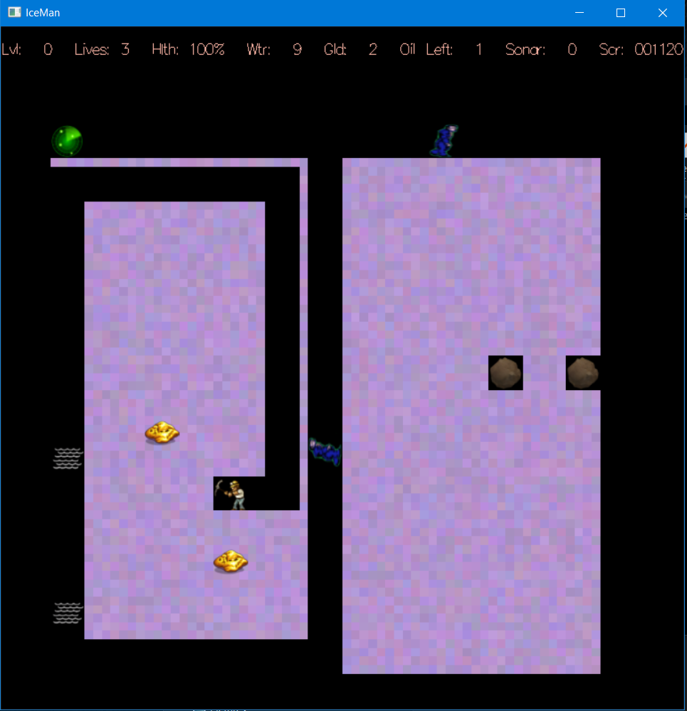

# IceMan

This is the final project for an advanced C++ class at El Camino College. I've decided to redo this project on my own to improve on the orginal code I sumbmitted.
These are the main files I'll be working on:
Actor.h
Actor.cpp
StudentWorld.h
StudentWorld.cpp

Here is an example image of the finished product.
Again, I've already worked on this project. This is simply a redo of my previous work to improve my coding skills.

